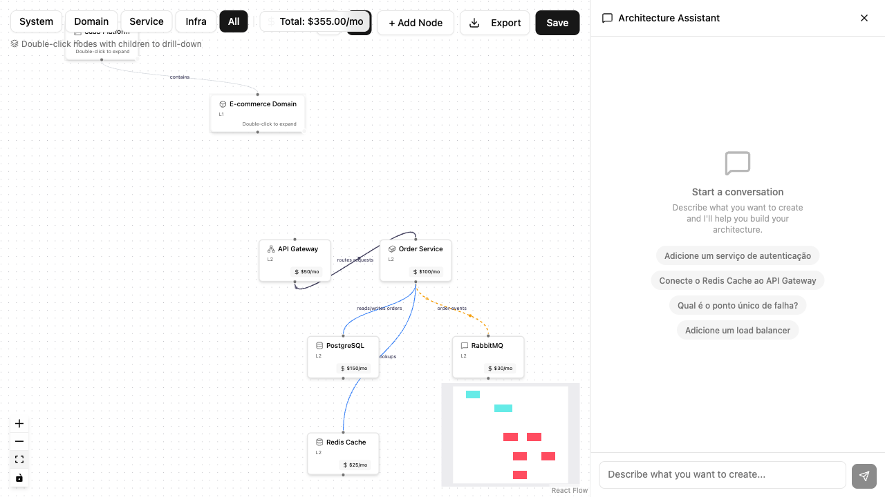
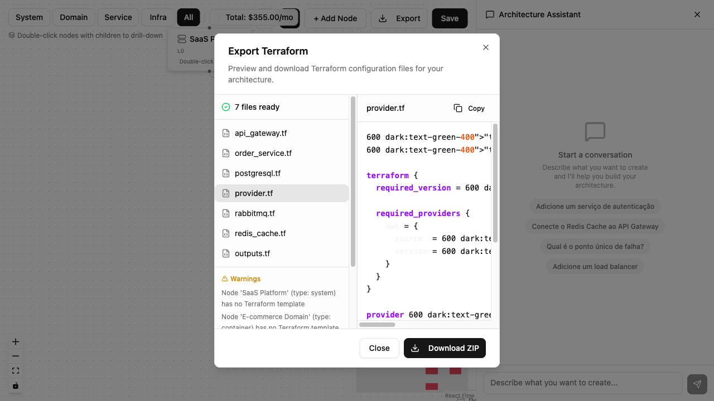
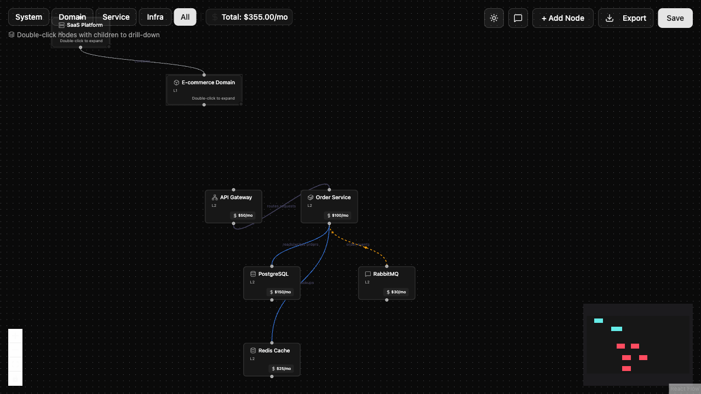

<p align="center">
  
</p>

<h1 align="center">Kuramei</h1>

<p align="center">
  <strong>倉明</strong> — AI-powered Architecture Decision-Making
</p>

<p align="center">
  <a href="https://kuramei.ai">Website</a> •
  <a href="#features">Features</a> •
  <a href="#screenshots">Screenshots</a> •
  <a href="#quick-start">Quick Start</a> •
  <a href="#architecture">Architecture</a> •
  <a href="#roadmap">Roadmap</a> •
  <a href="#contributing">Contributing</a>
</p>

<p align="center">
  <a href="https://github.com/aleparreira/kuramei/actions/workflows/backend-ci.yml"></a>
  <a href="https://github.com/aleparreira/kuramei/actions/workflows/frontend-ci.yml"></a>
  
</p>

<p align="center">
  
  
  
</p>

---

## The Problem

Architects today face critical decisions based on fragmented tools, intuition, and time pressure:

- **Diagrams** in one tool (draw.io, Lucidchart)
- **Cost estimates** in spreadsheets
- **Documentation** in Confluence
- **Infrastructure** disconnected from design

Everything is manual. Everything is disconnected. Decisions lack data-driven validation.

## The Solution

**Kuramei** transforms architecture decision-making:

```
Chat → Diagram → Cost → Terraform
```

Describe your system in natural language. Kuramei asks the right questions, generates architecture diagrams, estimates AWS costs in real-time, and exports production-ready Terraform.

## Features

| Feature | Description |
|---------|-------------|
| **Conversational Design** | Create architectures through AI-powered chat — no blank canvas |
| **Semantic Zoom** | Navigate from CEO view (system context) to DevOps view (infrastructure) |
| **Real-time Cost Estimation** | AWS pricing API integration for instant cost visibility |
| **Terraform Export** | Architecture as code, not just documentation |
| **Decision Versioning** | Every change is a decision with context: who, when, why |

## Screenshots

<p align="center">
  
  <br/>
  <em>Design architectures through AI-powered conversation</em>
</p>

<p align="center">
  
  <br/>
  <em>Export production-ready Terraform with one click</em>
</p>

<p align="center">
  
  <br/>
  <em>Full dark mode support for late-night architecture sessions</em>
</p>

## Quick Start

```bash
# Clone the repository
git clone https://github.com/aleparreira/kuramei.git
cd kuramei

# Start the development environment
docker-compose up -d

# Access the application
open http://localhost:3000
```

## Architecture

Kuramei runs on **100% AWS infrastructure**, provisioned with **Terraform**:

```
┌─────────────────────────────────────────────────────────────┐
│                        CloudFront                            │
│                      (CDN + HTTPS)                           │
└─────────────────────────────────────────────────────────────┘
                              │
          ┌───────────────────┴───────────────────┐
          ▼                                       ▼
┌─────────────────┐                    ┌─────────────────────┐
│   S3 (Landing)  │                    │    ECS Fargate      │
│   Static Site   │                    │   (API + Workers)   │
└─────────────────┘                    └─────────────────────┘
                                                  │
                    ┌─────────────────────────────┴─────┐
                    ▼                                   ▼
          ┌─────────────────┐               ┌─────────────────┐
          │  RDS Aurora     │               │  Secrets Manager │
          │  (PostgreSQL)   │               │  (Credentials)   │
          └─────────────────┘               └─────────────────┘
```

### Tech Stack

| Layer | Technology |
|-------|------------|
| Landing | Next.js + Tailwind (S3 + CloudFront) |
| Frontend | Next.js 15 + React 19 + React Flow |
| Backend | Python + FastAPI (ECS Fargate) |
| Database | RDS Aurora Serverless v2 (PostgreSQL) |
| AI | Multi-provider (OpenAI, Anthropic, Ollama) |
| Infrastructure | 100% Terraform |

## Kuramei Lens

Kuramei introduces the **Kuramei Lens** — a metamodel for architecture with C4 compatibility:

### Semantic Zoom Levels

| Level | View | Audience |
|-------|------|----------|
| L0 | System Context | CEO / Stakeholders |
| L1 | Domains | CTO / Tech Leadership |
| L2 | Services | Architects |
| L3 | Infrastructure | DevOps / SRE |

Same source of truth, multiple lenses.

## Roadmap

- [x] Documentation & Architecture Design
- [x] Landing Page (kuramei.ai)
- [ ] MVP: Chat → Diagram → Cost → Terraform
- [ ] Multi-provider AI (OpenAI, Anthropic, Ollama)
- [ ] What-if Simulation Engine
- [ ] C4 / ArchiMate Export
- [ ] Team Collaboration
- [ ] Enterprise SSO

## Why Open Source?

Kuramei is **100% open source** under MIT license. No hidden features, no paywall.

Architecture decisions shouldn't be locked in proprietary tools. Export everything. Own your data.

## Who It's For

| Profile | Need | How Kuramei Helps |
|---------|------|-------------------|
| **Solutions Architects** | Accelerate decisions | Chat → Architecture in minutes |
| **CTOs & Tech Leads** | Executive visibility | Semantic zoom + cost transparency |
| **DevOps & SRE** | Infrastructure as code | Terraform export from day one |
| **Startups** | Move fast | MVP architecture in minutes, not weeks |

## Philosophy

> **Conduct systems, not just build them.**

Kuramei is built by [Maestros](docs/maestros/manifesto.md) — engineers and architects who use AI to reason about complex systems.

If you're using AI to architect, to build, to make decisions — you're already a Maestro.

Come practice with us.

## Contributing

We welcome contributors of all levels.

**Quick start:**
1. Read the [Contributing Guide](CONTRIBUTING.md)
2. Say hi in [Discussions](https://github.com/aleparreira/kuramei/discussions)
3. Pick a [`good-first-issue`](https://github.com/aleparreira/kuramei/labels/good-first-issue)
4. Send a PR

*You're already a Maestro. Let's build together.*

## Author

<p align="center">
  <strong>Alexandre Parreira</strong><br/>
  <em>Sociotechnical Systems Architect & AI Engineer</em><br/>
  30+ years in technology • Founder @Kaltam AI
</p>

<p align="center">
  <a href="https://linkedin.com/in/aleparreira">LinkedIn</a> •
  <a href="https://github.com/aleparreira">GitHub</a> •
  <a href="https://x.com/aleparreira">X</a>
</p>

---

<p align="center">
  <em>"Clarity emerges."</em>
</p>

<p align="center">
  <a href="https://kuramei.ai">kuramei.ai</a>
</p>
